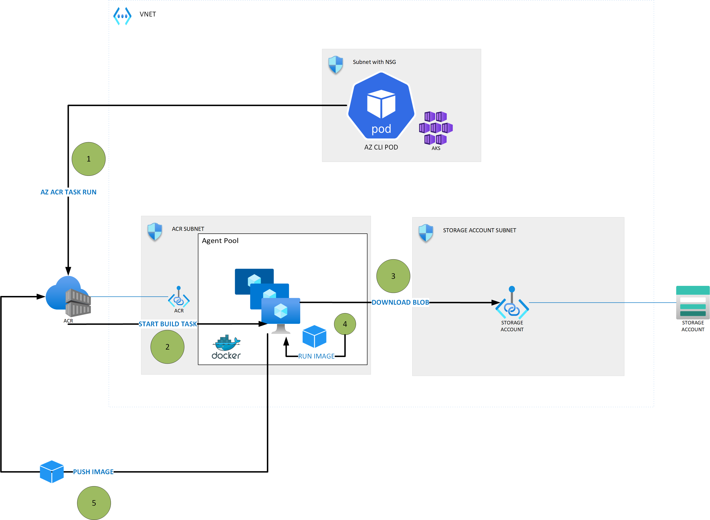

# Private ACR Tasks

## Problem Statement & Background
As of AKS Version 1.19+, containerd is the container runtime for linux node pools (details references [on the docs](https://docs.microsoft.com/en-us/azure/aks/cluster-configuration#container-runtime-configuration)). Therefore, prior workflows of using Docker to build images within your AKS cluster will no longer support connecting to a local Docker daemon on the node or using Docker-in-Docker.

A potential solution to support your image builds as part of a CI process where agents are run on your cluster is to leverage [ACR Build Tasks](https://docs.microsoft.com/en-us/azure/container-registry/container-registry-tasks-overview). ACR will spawn a task that will run your Dockerfile to build your image. However, another potential challenge arises which is what if my Dockerfile consumes internal/private artifacts? For example, maybe base images are stored in an internal registry that is not ACR, or maybe you want to pull artifacts from a private Storage Account or Version Control.

That's where we can leverage [Dedicated Agent Pools](https://docs.microsoft.com/en-us/azure/container-registry/tasks-agent-pools) with the ACR Tasks. Agent Pools can be deployed within a VNET so that you can access internal/private dependencies for your image builds and run your tasks in a private manner.

## Demo Solution with ACR Tasks and Dedicated Agent Pools



## Requirements for Deployment
1. Premium ACR Registry
2. [Outbound Firewall Rules](https://docs.microsoft.com/en-us/azure/container-registry/tasks-agent-pools#add-firewall-rules) for VNET-Injected Agent Pools
3. [Preview Limitations] of Agent Pools

> Reference: Review the following [doc](https://docs.microsoft.com/en-us/azure/container-registry/tasks-agent-pools) for additional updates/details.

## Deployment Steps

1. Deploy the Architecture

    > Important: You will need to provide a Resource Group Name when you initiate the deployment below.

    > Important: You will pass your SSH Public Key for the AKS Cluster that is created as a parameter when the bicep deployment is initiated below.

    ```bash
    az cloud set --name <AzureCloud | AzureUSGovernment>

    export LOCATION=<eastus | usgovvirginia | etc.>

    az deployment sub create \
        --name acr-demo-deployment \
        --template-file bicep/main.bicep \
        --location $LOCATION
    ```

2. Deploy the Pod to AKS

    ```bash
    az aks get-credentials -n aks-cluster -g acr-demo-rg

    kubectl apply -f pod.yaml
    ```

3. Run the following AZ CLI Command to Start the Task

    > Reference: This mocks the scenario of a self-hosted agent (github, devops, etc.) that would be running in the cluster and running as part of a CI/CD process to build an image.

## References
- [Container Image builds on Kubernetes clusters with Containerd and Azure DevOps self-hosted agents](https://techcommunity.microsoft.com/t5/fasttrack-for-azure/container-image-builds-on-kubernetes-clusters-with-containerd/ba-p/2121535)

- [Containerd limitations/differences](https://docs.microsoft.com/en-us/azure/aks/cluster-configuration#containerd-limitationsdifferences)